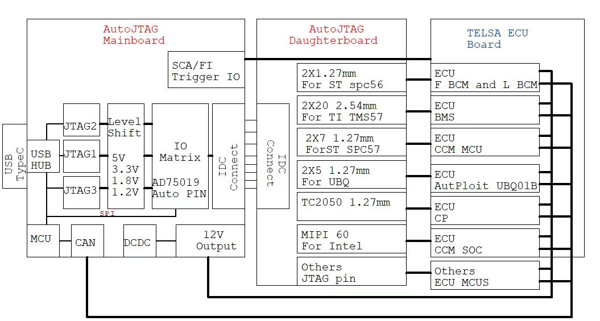

# AutoJTAG: An Open-Source Low-Cost Tesla ECU Firmware Security Toolkit

## Abstract

Recently, the U.S. government announced an investigation into and prohibition of the sale of internet-connected cars manufactured outside the United States, citing potential national security risks. Whether electric cars are truly secure, with their onboard operating systems collecting sensitive data from both vehicle owners and infrastructure, can be answered through comprehensive security research on all ECUs of electric vehicles.

Tesla is the world's best-selling electric car, with millions sold annually, approximately one every six seconds. Each car owner harbors significant curiosity about the security of their electric vehicle. While Musk has open-sourced the Linux kernel used in Tesla vehicles as well as Roadster this is a commendable move. However, the design blueprints and firmware for Tesla's best-selling Model series ECUs have not yet been open-sourced.

To address this, we have developed AutoJTAG, an open-source low-cost Tesla ECU firmware security assessment tool. With **AutoJTAG**, you can perform the following operations on nearly all Tesla ECUs:

1. Firmware Extraction

2. JTAG Debugging Host Software

3. Power Supply: Provide 12V

4. CAN Bus Communication and FI (Fault Injection)

5. Extraction and Research of EDR Data

In summary, we provide a hardware bridge tool for those unfamiliar with hardware but interested in security research, helping them break barriers. Simply connect the AutoJTAG hardware with a USB Type-C cable to easily conduct security research on Tesla ECUs and firmware.

## Demos

We will demonstrate some demos:

- AutoJTAG and MCU's BSDL file software to show real-time changes in specific IO voltage levels of MCU chips during communication between the car and ECU.

## To Be Done

Not all ECUs can extract firmware via AutoJTAG. According to our testing, at least the EDR airbag module ECU has added a password. Tesla's airbag module uses chips from Renesas.

In 2023, a new study showed that Renesas MCU passwords can be bypassed, and AutoJTAG may provide a research platform for Tesla airbag enthusiasts. For professional advanced automotive security researchers, perhaps they can conduct in-depth research on MCUs with secret JTAG additions.

Similarly, UDS services are also a core service for electric vehicle security. Riscure has published a paper discussing the security issues of UDS authentication services. The core is FI injection. But they used Huracan devices and Spider devices, which together cost over $100,000. AutoJTAG's FI function, while low-cost, may provide possibilities for research by vehicle networking security experts. FI power injection into ECU security apples and EDR data extraction and security research will be our focus for future work.

## Reference

1. OpenOCD: openpcd.org (Note: typical URL is openocd.org)

2. BSDL: <http://www.bsdl.info/>

3. Tesla ECU MPC56 BSDL: <https://www.bsdl.info/details.htm?sid=11bb577b73ac158c88ca59b002289d77>

4. FI Attack RH850: <https://icanhack.nl/blog/rh850-glitch/>

5. Apple iPhone Lightning JTAG Security Research: DEF CON 30 Presentation PDF

6. Tesla Roadster: <https://service.tesla.com/en-US/vehicle-models/Roadster>

7. Tesla Linux: <https://github.com/teslamotors/linux>

8. Tesla EDR: <https://edr.tesla.com/>
